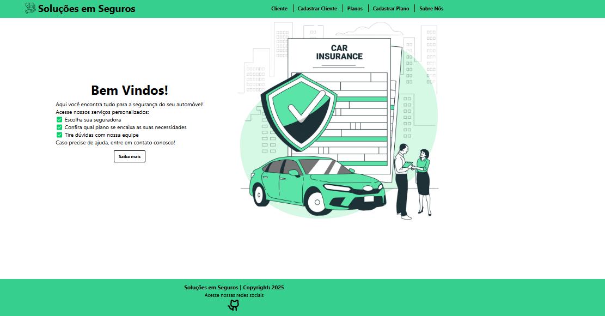

Projeto CMR

Este projeto consiste no frontend de uma aplicação para o gerenciamento de seguros automotivos, desenvolvido com React e Tailwind CSS. O objetivo foi criar uma interface moderna, responsiva e intuitiva, proporcionando uma experiência de usuário eficiente e otimizada para o setor de seguros.
 
Protótipo
 
 
</a>
 
 
🚀 Tecnologias
 
 
Esse projeto foi desenvolvido com as seguintes tecnologias:
 
 
React e Tailwind
 
 
Git e Github
 
 
Figma
 
 
